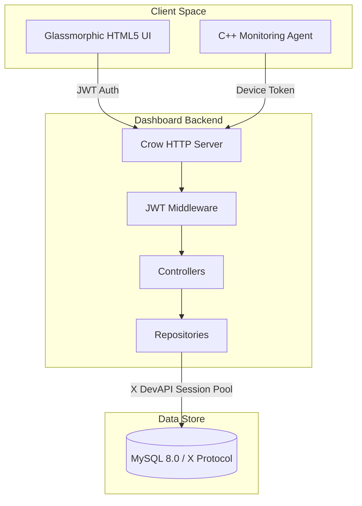

# Architecture Specifications

The Proactive IT Support Dashboard is designed with an MVC (Model-View-Controller) architecture, utilizing a separation of concerns between backend logic, data layers, and the frontend user interface.

## Architectural Components

### 1. Web API Layer (Crow HTTP Server)
- Fast, asynchronous micro-web server handling route dispatching, JSON serialization (via `nlohmann/json`), and payload validation.
- Employs **Local Middlewares** (`AuthMiddleware`) for path-specific authentication, allowing public metric ingestion endpoints to coexist with JWT-guarded administration paths.

### 2. Controller & Service Layer
- Handles core application flows (decoding request bodies, validating properties, and triggering repository logic).
- Handles utility integrations (e.g. generating JWTs via `JWTUtil` and verifying passwords via `BcryptUtil`).

### 3. Repository Layer (Data Access Pattern)
- Encapsulates direct database commands.
- Implements prepared parameters to prevent SQL injection.
- Direct database communication leverages the modern **MySQL X DevAPI** protocol via connection pooling.
